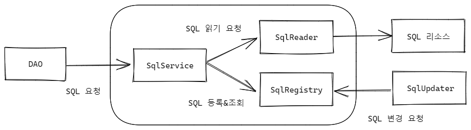
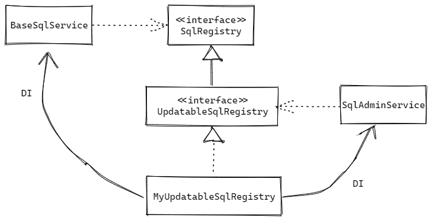

# 7. 스프링 핵심 기술의응용

 + SQL이 변경이 필요할 경우 DAO 코드가 수정 되어야 함.
 + SQL을 적절히 분리해 DAO 코드와 다른 파일이나 위치에 두고 관리하면 좀더 편하겠지?
 + 스프링 설정파일을 이용한 분리도 가능하나 SQL과 DI가 섞이게 된다.

 + SQL 서비스를 만들자.
 + SQL 서비스 책임 2가지
 + SQL 정보를 외부의 리소스로부터 읽어오는 것
 + 읽어온 SQL을 보관하고 있다가 필요 할때마다 제공 해줌.
 + 부가적인 기능으로 SQL을 필요에 따라 수정할 수 있는 기능

    public interface SqlService {
        String getSql(String key) throws SqlRetrievalFailureException;
    }

    public interface SqlReader {
        void read(SqlRegistry sqlRegistry);
    }

    public interface SqlRegistry {
    
        void registerSql(String key, String sql);
    
        String findSql(String key) throws SqlRetrievalFailureException;
    }

 + OXM : ObejctXMLMapping
 + XML과 자바오브젝트를 맵핑하여 상호변환해주는 기술

## 인터페이스 상속을 통한 안전한 기능 확장

 + DI 는 미래를 프로그래밍 하는 것 이다.

    
    public interface UpdatableSqlRegistry extends SqlRegistry {
    
        void updateSql(String key, String sql) throws SqlUpdateFailureException;
    
        void updateSql(Map<String ,String> sqlMap) throws SqlUpdateFailureException;
    }

 + SQL 업데이트 기능을 가진 새로운 인터페이스를 만들었을 때 기존에 SqlRegistry 를 사용하던 BaseSqlService 도 새로운 UpdatableSqlRegistry 인터페이스를 이용해야 할까?
 + NO!

 + 새로운 SQL 업데이트 기능까지 구현한 SQL 레지스트리 클래스를 MyUpdatableSqlRegistry 라고 할 때, 동일한 오브젝트를 DI 받지만 설계와 코드에서는 각각 필요한 인터페이스에 의존하고 있으면 된다.

 
 

## DI를 이용해 다양한 구현 방법 적용하기

 + ConcurrentHashMap
 + HashMap은 스레드 세이프 하지 않다.
 + ConcurrentHashMap은 안전하면서도 성능이 보장되는 동기화된 HashMap

    class ConcurrentHashMapSqlRegistryTest {
    
        UpdatableSqlRegistry sqlRegistry;
    
        @BeforeEach
        public void setUp() {
            sqlRegistry = new ConcurrentHashMapSqlRegistry();
            sqlRegistry.registerSql("KEY1", "SQL1");
            sqlRegistry.registerSql("KEY2", "SQL2");
            sqlRegistry.registerSql("KEY3", "SQL3");
        }
    
        @Test
        public void find() {
            checkFindResult("SQL1", "SQL2", "SQL3");
        }
    
        private void checkFindResult(String expected1, String expected2, String expected3) {
            assertEquals(sqlRegistry.findSql("KEY1"), expected1);
            assertEquals(sqlRegistry.findSql("KEY2"), expected2);
            assertEquals(sqlRegistry.findSql("KEY3"), expected3);
        }
    
        @Test
        public void unknownKey() {
            Assertions.assertThrows(SqlRetrievalFailureException.class,
                    () -> sqlRegistry.findSql("SQL9999!@#$"));
        }
    
        @Test
        public void updateSingle() {
            sqlRegistry.updateSql("KEY2", "Modified2");
            checkFindResult("SQL1", "Modified2", "SQL3");
        }
    
        @Test
        public void updateMulti() {
            Map<String, String> sqlmap = new HashMap<>();
            sqlmap.put("KEY1", "Modified1");
            sqlmap.put("KEY3", "Modified3");
    
            sqlRegistry.updateSql(sqlmap);
            checkFindResult("Modified1", "SQL2", "Modified3");
        }
    
        @Test
        public void updateWithNotExistingKey() {
            Assertions.assertThrows(SqlUpdateFailureException.class,
                    () -> sqlRegistry.updateSql("SQL9999!@#$", "Modified"));
        }
    }

    public class ConcurrentHashMapSqlRegistry implements UpdatableSqlRegistry {
    
        private Map<String, String> sqlMap = new ConcurrentHashMap<>();
    
        @Override
        public void updateSql(String key, String sql) throws SqlUpdateFailureException {
            if (sqlMap.containsKey(key)) {
                sqlMap.put(key, sql);
                return;
            }
    
            throw new SqlUpdateFailureException(key + "is empty");
        }
    
        @Override
        public void updateSql(Map<String, String> sqlMap) throws SqlUpdateFailureException {
            for (Map.Entry<String, String> entry : sqlMap.entrySet()) {
                updateSql(entry.getKey(), entry.getValue());
            }
        }
    
        @Override
        public void registerSql(String key, String sql) {
            sqlMap.put(key, sql);
        }
    
        @Override
        public String findSql(String key) throws SqlRetrievalFailureException {
            if (sqlMap.containsKey(key)) {
                return sqlMap.get(key);
            }
    
            throw new SqlRetrievalFailureException(key + "is empty");
        }
    }