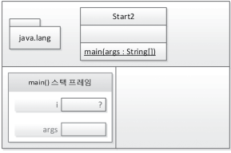

# chapter02

## 자바 프로그램의 개발과 구동

 + 소프트웨어 개발 도구 -> JDK - 자바 개발도구
 + 운영체제 -> JRE - 자바 실행 환경 JVM용 OS
 + 하드웨어 - 물리적 컴퓨터 - > JVM- 자바 가상 기계 
 + 배포는 JDK가 JRE 포함 JRE JVM 포함 형태 

 + Write Onec Run Anywhere

## 메모리를 사용하는 방식

 + 코드 실행 영역 / 데이터 저장하는 영역 
 + 데이터 영역은 -> 스태틱 영역 / 스택 영역 / 힙 영역으로 나

## 자바의 존재하는 절차적 / 구조적 프로그래밍의 유신

 + 절차적 프로그래밍 : goto 사용 금지. (순서가 뒤죽박죽..)
 + 구조적 프로그래밍 : 함수를 사용하세요! 
 + 중복코드 한곳에 모아놓음, 논리를 함수 단위로 분해해서 이해하기 쉽게.
 + 공유 사용시 무제가 발생하기 쉬운 전역 변수보단 지역 변수를 쓰자는 것도 있음! 
 + 결론 : 중복코드 제거 / 논리 분할
  
 + 그렇다면? 객체 지향 언어에서 절차적 구조적 프로그래밍의 유산은 메서드 안에서 확인가능. (함수 = 메서드)
 + 객체지향 프로그래밍에서 제어문이 존재 할 수 있는 유일한 공간은 바로 메서드 내부기 때문

## 함수 ? 메서드 ?

 + 전혀 다르지 않다.
 + 절차적 구조적 프로그래밍에선 함수 -> 객체지향 언어에선 메서드
 + 허나 함수는 클래스나 객쳋 아무 관계가 없지만 / 메서드는 클래스 내부안에서 정의해야 함.
 + import는 타이핑을 적게하기 위한 편의 기능!

## 메서드 스택 프레임

 

 
 

 + T 메모리 변화를 관찰해 보자

 1. JRE 먼저 프로그램 안에 main()메서드 존재 확인. 
 2. start 클래스에서 main 메서드 발견, -> JVM 부팅 시작
 3. JVM은 전처리 과정을 시작한다.
 4. java.lng 패키지를 T메모리 스태틱 영역에 가져다 놓고, 개발자가 작성한 모든 클래스 임포트 패키지 역시 다 넣는다. 그래서 클래스들의 놀이터라고 함.

 5. 다음으로 메서드 들의 놀이터 스택 영역에 스택 프레임이 할당 됨(main() 메서드).!(JVM 메모리 구조 참조! 하자)
 

 6. args 인자도 스택 프레임에 할당되 스택영역에 저장됨 ! - > 그 다음 메서드 안 의 첫 명령문을 실행하게 됨.
 7. 정리해보면... 스택영역에 메서드가 스택프레임에 할당되고 그안에 인자나 변수들도 따로 할당되는거 같다. 다 할당 되면 실행..
 8. JVM 메모리 구조를 보면 한 스택안에 여러 스택프레임들이 주르르륵~ 다할당되면 밑에서부터 실행실행... JVM 메모리구조 참고해서 같이 공부하면서 했더니 이해가 더 쉬움..

  + 순서
  + JRE -> JVM 부팅  -> JVM 메모리 구조를 만들고 패키지 로딩 ,각종 클래스 로딩 , 메서드 스택프레임 배치,, 변수공간 배치등 일 처리.
  + **여기서 스택 프레임이 생성되는 과정은 메서드에 { 중괄호 시작 부분 } 끝부분은 스택 프레임이 소멸 됨. 메서드 외에 if{ For { 이런 것도 있다**
  + main() 메서드가 끝나면 JREsms JVM 종료하고 JRE 자체도 운영체제 상 메모리에서 사라짐.

## 변수와 메모리

 

 + 스텍 프레임 안에 밑 부터 차곡차곡 변수 공간 마련
 + ? 값은 청소하지 않는 쓰레기 
 + 코드를 순차적으로 실행하면서 값이 들어가게 된다.

### 스택 프레임에 갇힘

 + 변수 ! 너 어 디 있니 답 공개.
 + 변수는 스태틱 , 스택 , 힙 영역 모두에 다 존재 하지만 목적이 다르다.
 + 각각 지역 변수, 클래스 멤버 변수, 객체 멤버 변수 로..
 + 지역변수 : 스택 영역 스택 프레임 안에서 생명주기 스택 프레임 사라지면 없어짐
 + 클래스 멤버 변수: 스태틱 영역에서 생명 주기, 스태틱 영역에 자리 잡으면 JVM 종료 될 때 까지 고덩된(static) 상태로 그자리에 계속 존재
 + 객체 멤버 변수 : 힙에서 일생을 보냄, 가비지 컬렉터에 의해 없어짐.

 + +++++++++++++공부하다보니 번뜩 ? 지역변수에서만 사용하고 벗어나서 사용하면 안돼는 이유가 스택프레임이 사라지면서 지역변수가 사라지기 때문에 그 지역변수를 사용 할 수가 없구나.. 

 + 외부 스택 프레임에서 내부 스택프레임의 변수에 접근하는 것은 불가능 하나 그 역은 가능하다 - 제임스 고슬링
 + 지역(스택 프레임) 에서만 사용가능하고 외부는 사용불가능함 / 그 지역이 사라지면 지역 변수로 메모리에 사라짐 그래서 지역 변수라!

### Call by Balue

 + 책에선 스택프레임 내 매서드끼리 각자 지역변수를 같는 별도의 공간이 있는대 이걸 값에 의한 호출이라 설명한다. // 밑에 좀더 자세히.
 + 메서드 블랙박스화 -> 입력 값들 과 반환값 의해서 메서드 사이에서 값이 전달 될뿐 **내부의 지역 변수는 볼수 없다!**
 + 메서드를 호출 하면서 인자로 전달되는 것은 변수 자체가 아님 , 변수가 저장한 값만 복제해서 전달 -> 값에 의한 전달
 + 왜 각 스택프레임에 저장된 메서드들의 지역 변수 끼리는 참조를 할 수 없을까?

### 짐작

 + 이치에 맞기 때문 메서드는 서로의 고유공간 / 서로 무단침입하면 문제 유발
 + 포인터 문제 : 서로 지역변수간 정확한 위치를 알아야하는대 자바에는 포인터를 사용할 수 없다.
 + 호출하는 메서드 내부의 지역변수를 호출당하는 쪽에서 제어할 수 있게 코드 만드려면 포인터로 주고 받아야됨. 위에설명한 두번째 문제랑 유사하게 됨.

## 전역 변수와 메모리 : 전역 변수를 쓰지 말아라.

 + 두 메서드 사이에 값을 전달하는 방법 -> 메서드를 호출 할때 메서드의 인자를 이용하는 방법 + 메서드 종료시 반환값 넘겨주기.
 + 스태틱 변수 선언시 스태틱 영역에 변수 공간이 할당 됨. 클래스의 멤버로 공간을 만들어 저장 됨.
 + 스택 프레임에 종속적인 지역변수 < - > 스택 프레임에 독립적인 전역 변수
 + 전역 변수는 코드 어느 곳에서 접근 가능해서 전역변수 또는 공유 변수
 + 프로젝트가 커지면서 값이 변경되거나 그러면 추적이 어려워지기 때문에 지양하는게 맞다
 + 전역 상수로 쓰는 것은 추천 (Ex: 3.14) 

## 멀티 스레드 / 멀티 프로세스의 이해

 + 멀티스레드는 T 모델에서 스택영역을 스레드 개수 만큼 분할해서 쓰는 것
 + 멀티프로세스는 다수의 데이터 저장 영역 즉 다수의 T 메모리를 갖는 구조
 + 멀티프로세스는 각 프로세스마다 각자의 T메모리 가 있고 고유의 공간이며 서로 참조가 안됌
 + 멀티스레드는 T메모리만 사용하는데 스택 영역만 분할
 + 자바 웹 프로그래밍에서 요청당 스레드 (servlet)가 요청당 프로세스보다 더 효율 적인지 이해가 가능.
 + 쓰기가능한 전역 변수를 선언하면 멀티 스레드일때 문제가 발생.
 + 스레드의 공유영역 (스태틱 과 힙)  전역 변수를 A를 할땅했을때 다른 스레드가 A 에 20 할당 했을시 문제 발생.

