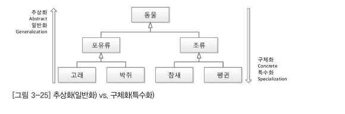

# chapter03

# 자바와 객체 지향

 + 세상에 존재하는 모든 것은 사물 객체이다.
 + 각각의 사물은 고유 함
 + 사물은 속성을 가지고 행위를 험
 + 사물을 class 분류 해서 이해하는 것이 인간 인지

## 객체 지향의 4대 특성 캡 상추다

 + 캡슐화 정보은닉
 + 상속 재사용
 + 추상화 모델링
 + 다형성 사용 편의

 
## 클래스 vs 객체

 + 클래스는 분류에 개념
 + 객체는 실체 

## 추상화: 모델링 

 + 추상 : 여러가지 사물이나 개념에서 공통되는 특성이나 속성 따위를 추출하여 파악하는 작용
 + 추상화 : 객체지향의 추상화는 모델링이다.
 + 구체적인 것을 분해해서 관찰자가 관심 있는 특성만 재조합 한것으로 정리!

### 사전적 용어로 객체를 알아보자.

 1. object : 물건 , 물체 , 목적등,, 음 ,, 객체보단 개체라는 뜻이 어울린?
 2. 개체 : 전체나 집단에 상대하여 하나하나의 낱개에 이르는말 / 하나의 독립된 생물체, 필요한 독립적인 기능을 가지고 있음.
 3. 객체: 세상에 존재하는 유일무이한 사물. / 생물이건 무생물이건 속성과 기능을 가지고 있다.

### 클래스

 + 클래스 : 분류 , 집합 같은 속성과 기능을 가진 객체를 총칭하는 개념
 + 쉽게... -> 클래스:객체 = 펭귄:뽀로로 사람:김연아 등..
 + 객체를 특성(속성+기능)에 따라 분류하니 객체를 통칭할 수 있는 집학적 개념 즉!
 + 클래스(분류)가 나오게 된다.

 + 객체는 유니크한 사물
 + 클래스는 같은 특성을 지닌 여러 객체를 총칭하는 집합의 개념 < 중요 한듯

 + 클래스를 이용해 object (Ex: 사람 홍길동 = new 사람())을 만들 떄
 + object라는 표현보단 인스턴스라는 표현을 씀

## 애플리케이션 경계

 + 컨텍스트라고불려짐.
 + 내가 만들고자 하는 애플리케이션은 어디에 사용 될까?
 + 애플리케이션 경계에 따라 클래스의 설계가 바뀜
 + 여기서 추상화개념 다시 정리
 + 추상화 : 구체적인 것을 분해해서 관심 영역(애플리케이션 경계)에 있는 특성만 가지고 재조합 = 모델링!

## 모델

 + 모델은 실제 사물을 완벽히 복제가아니라
 + 목적에 맞는 관심 있는 특성만 추출해서 표현하는 것.
 + 모델은 추상화를 통해 실제 사물을 단순하게 묘사 함 

## 강조

 + 클래스 설계를 위해 애플리케이션 경계를 정한다.
 + 객체지향에서 추상화의 결과는 클래스다
 + 상속을 통한 추상화 구체화
 + 인터페이스를 통한 추상화
 + 다형성을 통한 추상화 
 + 자바는 class 키워드를 통해 추상화를 지원함.

## 객체 관계

 + class 객체참조변수 = new class();
 + 객체참조변수에는 객체의 주소(포인터) 할

## 추상화 T 메모리

 + 애플리케이션 경계로 설계한 UML 클래스 다이어 그램

 + T 메모리 구조
 + 메인 클래스 Mouse 클래스 스태틱영역에 할당
 + **아직 변수 저장 공간이 안보이는데 클래스에 속한 속성이아닌 객체에 속한 속성이기 때문**
 + 객체가 생성돼야만 속성의 값을 저장하기 때문에 힙영역에 할당 됨.
 + 메인에 줄쳐져있는댄 메인클래스에 클래스 멤버 메서드 이고
 + sing에 밑줄이 안쳐져있는건 객체의 멤버 메서드기 때문
 + 여기서 클래스 멤버 메서드란 클래스내 스태틱으로 저장되잇는 변수

 + 객체 참조 변수는 힙영역에 객체 주소를 가지고 있다.

 + 이후 미키 = null 이며되면 가바지 컬렉터가 수거해 가서 없어져 버린다.

## 클래스 멤버 vs 객체 멤버 = static 멤버 vs 인스턴스 멤버

 + 클래스 멤버 = static 멤버 = 정적 멤버
 + 객체 멤버 = 인스턴스 멤버
 + 정적 메서드는 JVM 구동시 스태틱 영역에 바로 저장되 있어 객체가 없어도 실행 가능.
 + 정적 멤버 는 보통 객체들이 공통된 값을 가질때 사용 (ex  : 사람 클래스의 인구 , 고양이 클래스의 다리갯수등..)
 + 정적메서드는 모통 Math클래스 예시..

## 멤버 변수는 왜 초기화 안함?

 + 멤버 변수는 공유 변수의 성격을 가지고 있음.
 + 객체 변수는 하나의 객체안에서 다수의 객체 메서드가 공유하는 변수.
 + 클래스 변수는 전역변수로서 프로그램 어디서든 접근 가능하는 공유 변수다.
 + 기본값으로 초기화 됨. 누가 초기화해야 한다고 규정 X

## 상속 : 재사용 확장

 + 객체지향 에서의 상속은  상위 클래스의 특성을 하위 클래스에서 (특정상속)하고 더해 필요한 속성 추가
 + 즉 확장을해서 사용하는 의미.
 + 보통 클래스의 특성을 상속한다는 말에서 특성을 빼고 클래스를 상속하는 뜻으로 오해를 함. 부모 - 자식 관계가 나와버림
 + 그래서 앞으론 상위클래스 - 하위클래스 / 슈퍼클래스 서브 클래스로 정의하자
 + 이해를 -> 상속이아닌 확장 , 세분화, 개념으로 이해하자
 + 상위 클래스로 갈수록 추상화 , 일반화 , 하위 클래스로 갈수록 구체화 특수화 .

 + 반드시 기억해야될 문장 하위클래스는 상위 클래스다. (Ex: 아들은 아버지다 X  고래는 포유류다 O)
 + inheritance가 아닌 extend! 

## 상속의 강력함

 + 클래스 명은 클래스 답게 객체 참조 변수명은 객체스럽게 작성하자.
 + 상위클래스에서 구현한 메서드는 하위클래스에서 사용 가능하다.

## 상속은 is a 관계를 만족해야 한다?

 + 펭귄 is a 동물  
 + 하위클래스 is a 상위클래스
 + 객체와 클래스 관계로 오해될 소지가 있음. 클래스와 인스턴스.
 + 객체 is a 클래스
 + 김연아 is a 사람 -> 김연아는 한명의 사람이다 .
 + 좀 어색하다 좀 더 명확한 표현은
 + is kind of 

  + 객체 지향의 상송은 상위 클래스의 특성을 재사용
  + 객체 지향의 상속은 상위클래스의 특성 확장
  + 객체 지향의 상속은 is kind of  다.

## 다중 상속과 자바 .

 + 왜 자바는 다중상속 지원 안하지?
 + 인어 -> 인간 / 물고기 상속 하면 ? 수영해는 어떻게표현해..

## 상속 and 인터페이스..

 + 인터페이스 : 구현 클래스 is able to 인터페이스
 + 구현 클래스는 인터페이스 할수 있다.
 + 고래는 헤엄칠수 있다.

 
 + 인터페이스는 무엇을 할수 있는 형태로 만드는게 좋다.

 + ex) Serializable : 직렬화 할수 있는
 + clonable 복제할수 있는..

 + 상위클래스는 하위클래스에 물려줄 특성이 많을수록 / 인터페이스는 구현을 강제할 메서드가 적을 수록
 + 리스코프 치환원칙에 따른 이유로 (상속)
 + 구현 메서드가 적을수록 인터페이스 분할 원칙에 따른 이유.

## 상속과 T 메모리

 + **하위 클래스 인스턴스가 힙영역에 생길때 상위 클래스의 인스턴스로 힙영역에 생성됨 중요** object 클래스의 인스턴스도 함께 생성됨 ..

 + Penguin pororo = new Penguin();
 + 앞에 선언한 클래스 힙 주소를 따라감..

## 다형성 : 사용 편의성

 + 다형성이라하면 오버라이딩 , 오버로딩 이라 할수 있음.
 + 오버라이딩 : 같은 매서드 이름 인자 목록으로 상위 클래스 매서드 재정의
 + 오버로딩 : 같은 메서드 이름, 다른인자목록으로 다수의 메서드를 중복 정의
 + ride: 올라타다 / load : 적재 하다.

## 다형성과 T 메모리

## 캡슐화 : 정보 은닉 

 + 상속을 받지 않았따면 객체 멤버는 객체를 생성한수 객체 참조변수를 이용해 접근
 + 정적 멤버는 클래스명 정적멤버 형식으로 접근하는 것을 권장 .
 + 정적 멤버에 접근할때 클래스명 정적멤버 형식으로 접근하는게 효율 적.

## 참조 변수의 복사 

 + 객체 참조 변수는 저장하고있는 값을 주소로 해석함
 + 그래서 -> 얕은 복사 .

 + int a = b / Member a = b
 + 값 자체로 해석하느냐  / 주소값으로 해석하느냐 차이.