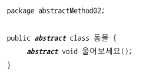
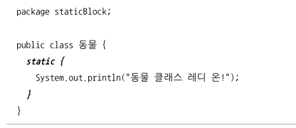
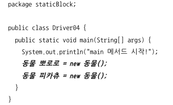
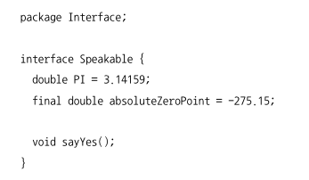
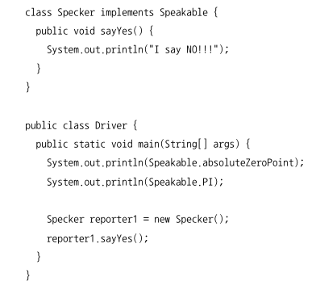

# chapter04

## abstract 키워드 - 추상상 메서드와 추상 클래스

 + 구현부가 없는 메서드, 
 + 추상메서드 하나만 가지고 있으면 무조건 추상 클래스 선언!

 
 
 + 책 속 예시
 + 동물은 최상위 클래스인데 울어야될 방법이 없는데.. 만약 구현부가있어서 실행된다면? X

 + 추사 클래스는 객체를 만들지 못함.
 + 하위 클래스에게 메서드 구현 강제 오버라이딩 강제

## 생성자 

 + 클래스의 인스턴스 
 + 기본적으로 생성자가 없으면 기본 생성자 디폴트 생성자가 있음
 + 인자가 있는 생성자를 만들면 기본 생성자는 만들어 주지 않음.

## 클래스 생성 시의 실행 블록 static 블록.

 + 기존 프로그램이 시작되면 모든 패키지 와 모든 클래스가
 + T메모리 스태틱 영역에 로딩 된다고 설명함.
 + 하지만 실제로는 해당 패키지 또는 클래스가 처음으로 사용될때 로딩이 되는 것이다.

 

 + 여러개를 사용해도 스태틱 블록은 한번만 실행 
 + 클래스 정보는 해당 클래스가 코드에서 맨 처음 사용 될 때
 + T 메모리의 스태틱 영역에서 로딩 됨.
 + 단 한번 해당 클래스의 static 블록이 실행

### 클래스가 처음 사용 될 때

 + 클래스의 정적 속성을 사용할 때
 + 클래스 정적 메서드 사용 할 때
 + 클래스의 인스턴스 최초로 만들 때

## final 

 + final class?  상속을 허락하지않는 최종 클래스가 되버림 !
 + 또한 메서드에 Final을 붙이면 오버라이딩이 안됀다.

## Instanceof 연산자

 + 특정 클래스인지 알아봄.
 + 리스코프치환원칙을 어기는 코드에 주로나타남 자세한설명은 뒤에서.

 
## interface / Implements 키워드

 + 인터페이스는 추상 메서드와 정적 상수만 가질 수 있다.
 + 따로 메서드에 public , abstract ,속석에 public , static final을 붙이지
 + 않아도 자동으로 붙여줌 ..

## 좀더 알아 보기

 + 클래스에서 멤버 클래스를 하나 선언한다 가정했을때
 + 객체를 100개 생성하면  멤버 메서드도 100개를 선언할까?
 + 아니다. 스태틱영역에 하나만 보유하고 나머지는 자기자신을 나타내는 this 객체 참조 변수를 넘김.

