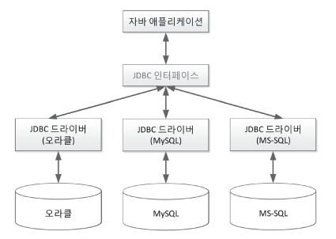
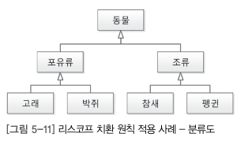
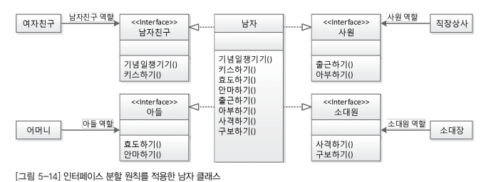

# chapter05 - 객체 지향 설 

# 정리 & 요약

+ 솔리드 5원칙은 결합도를 낮추면서 응집도를 높히는 지키는 개념
+ ## SRP(단일 책임의 원칙) : 클래스 메서드등 하나의 역할고 책임이있어야 된다.
+ 그래서 주로 공통된 부분을 클래스로 따로 만들어 상속을 받고 상속받은 객체는 그 책임과 역할의 맡게 따로 구현해 SRP를 지킨다.

## 개방 폐쇄의 원칙 : 
+  JDBC , JVM  자동차라는 인터페이스를 두고 여러 종류의 자동차를 구현 가능
+ 자동차를 다른걸로 변경한다? 확장한다는 의미. 스프링에서 자주 써본 기억이 있다. 하나의 인터페이스에 요구사항에 맞는 구현체를 개발해 교체 할 수 있음.
+ 유지보수에 편하고 인터페이스를 적용하는 클라이언트는 영향을 받지 않음.
+ 사용자와의 인터페이스가 바뀌지않는한 인터페이스에 함수들을 이용하는건  인터페이스 구현이 무엇으로 변경되든 영향을 받지 않는다.

## 리스코프 치환원칙
+ 객체 상속을 잘 사용하면 자연스럽게 이루어 지는것.
+ 하위 클래스의 인스턴스는 상위형 객체 참조 변수에 대입해 상위클래스 인스턴스 역할!!(중요) 하는데 문제가 없어야 함.
+ 더 중요한 것 상속은 조직도가 아니라 분류도 이다. 포유류 고래 = New 고래 ();
+ AutoCloseable  자동으로 닫힐수 있어야해 , Cloneable 복제할수 있어야해

## 인터페이스 분리 원칙
+ 단일책임원칙에 또다른 방법, 인터페이스로 역할을 제한함.
+ 인터페이스 최소주의 외부 공개메서드 최소화.
+ 상위클래스는 풍성하게 하위클래스는 빈약하게 (형변환)

## 의존 역전의 법칙

+ 자기 보다 변하기 쉬운 것에 의존하던걸 -> 변하기 쉬운것에 영향받지 않게 하는것
+ 자신보다 변하기 쉬운 것에 의존 하지 말자.

## 솔리드 5원칙 등장

 + 결합도를 낮추자 -> 의존성을 줄이란 얘기 - > 객체 재사용 수정 유지보수
 + 응집도를 높히자. -> 모듈 내부에 구성요소들이 기능적으로  관련성도 응집도가 높은 모듈은 하나의 책임에 집중 , 독립성이 뛰어나 재사용 유지보수 용이 : 단일 책임의 원칙
 + 자체가 아닌 개념으로 생각하자.

## SRP- 단일 책임 원칙 클래스

 + 어떤 클래스를 변경해야 하는 이유는 오직 하나뿐 - 로버트 C 마틴
 

 + 남자라는 하나의 클래스보단  아들 남자친구 직장상사 소대장 이런식으로 역할과 책임을 나누자.
 + 군번 예 경우 남자 / 여자로 클래스를 나눈 후 구현. 공통된 속성은 사람이란 상위 객체로 상속받자.. 상속  상속..
 + 디비에 정규화과정도 단일책임의 원칙에 해당 된다.

## 단일 책임 원칙 매서드
 
 + 강아지란 클래스에 소변을 누다 라는 메서드가있다.
 + 수컷 강아지와 암컷 강아지를 보면 소변누는 자세가 틀리기때문에 if문으로 분기를 해줘야한다.
 + 강아지란 클래스를 상속받는 수컷강아지/ 암컷강아지 클래스를 만들고 각자 소변을 보다를 따로 구현해주자.

## OCP - 개방 폐쇄의 원칙

 + 소프트웨어 에 엔티티(클래스,모듈,함수)는 확장에 대해서 열려있어야 되나 변경에 대해서는 닫혀있어야 된다. 로버트 C 마틴
 + 자신의 확장에는 열려있고 주변에 변화에 대해서는 닫혀 있어야 된다.

 + 개방 폐쇄 원칙을 가장 좋은 예 JDBC
 + 디비를 변경한다는 건 자기 자신을 확장한다.
 + 그 외 Ibatis, Mybatis 등 예를 볼수 있다.
 + JVM 역시 운영체제별로 목적 파일이 있기때문에 개발자는 따로 신경을 쓰지 않아도 됨.

## LSP - 리스코프 치환원칙
 
 + 서브 타입은 언제나 자신의 기반 타입으로 교체할수 있어야 한다.
 + 하위 클래스의 인스턴스는 상위형 객체 참조 변수에 대입해 상위클래스의 인스턴스 역할을 하는데 문제가 없어야 한다.

 + 객체 지향의 상속은 분류도가 되야 된다.
 + 하위 클래스는 상위 클래스의 한 종류다. ( 하위클래스 is a kind of 상위 클래스)
 + 구현 분류는 인터페이스 할 수 있어야 한다 ( 구현 클래스 is able to 인터페이스) -? AutoCloseable 자동으로 닫힐 수 있어야 함, Appendalbe - 덧 붙일수 있어야함  Clonalbe - 복제 할 수 있어야 함. Runnable - 실행 가능해야 한다.

 + 위 두 개는 상속의 조건이면서 리스코프 치환원칙을 잘 지키는 예이다.

 + 아버지란 상위 클래스 딸이란 하위 클래스.
 + 아버지 딸 = new 딸() 아빠의 역할을 맡는 딸? 뭔가 이상함.
 + 동물 뽀로로 = new 펭귄() 자연스럽다.
 + 상속은 계층도가 아니라 분류 이다. 

 + 가장 적절한 예시.
 + 하위 존재들이 상위 존재 역할을 하는데 문제가 없다.
 + 리스코프 치환원칙이란 객체 지향의 상속의 특성을 올바르게 활용하면 자연스럽게 얻는것.

## ISP 인터페이스 분리 원칙
 
 + 클라이언트는 자신이 사용하지 않는 메서드에 의존 관계를 맺으면 안 된다.

 + 단일책임 원칙처럼 남자를 남자친구 사원 아들 등 나누는 것도 있지만..?

 + 단일책임원칙에 또다른 방법론이다. 
 + 역할만 인터페이스로 제한 한다.. 보통 단일책임 원칙적용하는게 더 좋음
 + 또 추가로 인터페이스 최소주의의 원칙, 메서드를 외부에 공개할때 최소한의 메서드만 제공.
 + 번외 상속을 사용할때 상위클래스는 풍부하고 하위 클래스는 빈약할 수록 좋다.(형변환)

## DIP - 의존 역전의 법칙

 + 고차원 모듈은 저차원 모듈에 의존하면 안된다.
 + 이 두 모듈 모두 다른 추상화 된것에 의존해야함.
 + 추상화 된 것은 구체적인 것에 의존하면 안됨 , 구체적인것은 추상화 된 것에 의존해야 함.

 + 자동차 -> 스노우타이어의존  타이어는 계속 교체해줘야 해!
 + 자동차 -> 타이어 인터페이스 -> 스노우타이어 , 일반타이어,,... 개방 폐쇄의원칙에서 보던건데?
 + 기존 스노우타이어는 아무것도 의존하지않지만 타이어 인터페이스 의존 / 자동차는 추상화된 타이어 인터페이스를 추가해 둠.
 + 의존관계가 역전 됨.

 + 자신 보다 변하기 쉬운 것에 의존하던 것을 추상화된 인터페이스나  상위클래스를 두어 변하기 쉬운것의 변화에 영향받지 않게 하는것이 의존 역전 원칙.
 + 추가로  "자신보다 변하기 쉬운 것에 의존하지 말자"
 + 상위클래스 , 인터페이스 ,추상클래스를 의존하라는 것이 의존 역전의 원칙 ( 변하지 않을 가능성이 높기 때문 )

