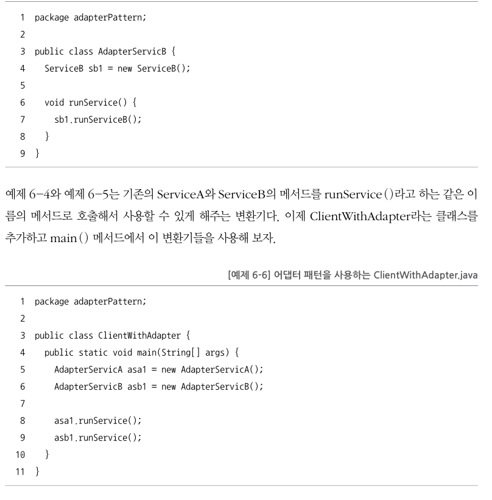
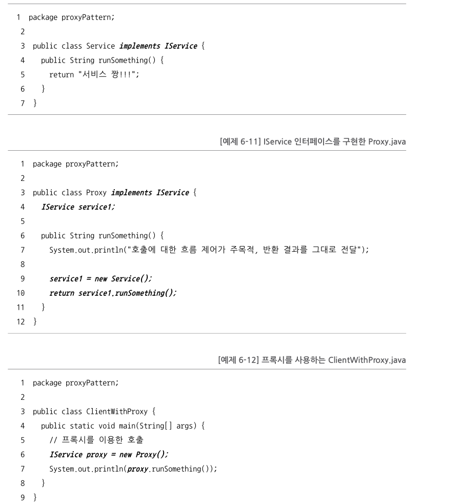
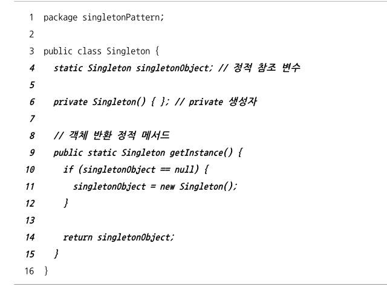
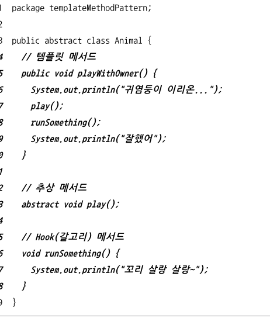
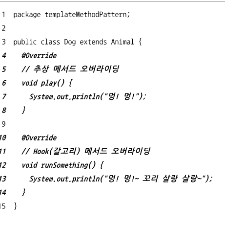
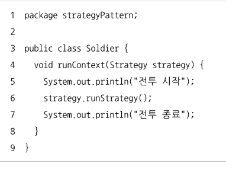
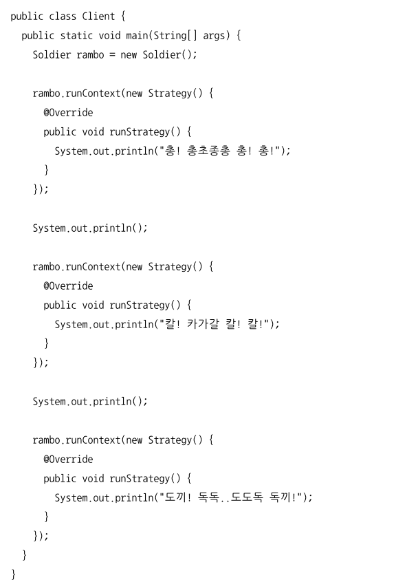
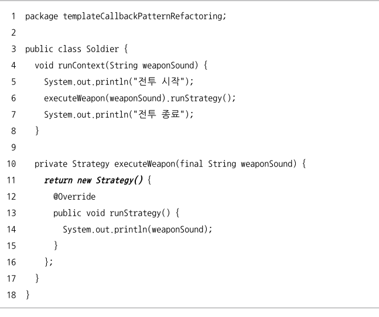

# chapter06 - 스프링이 사랑한 디자인 패턴

  + 이전에 많은 개발자들이 고민하고 정제한 사실상의 표존 설계 패턴인 디자인 패턴
  + 레시피로 비유 하자.
  + 스프링 프레임워크? OOP 프레임 워크
  + 디자인 패턴은 상속, 인터페이스 ,합성 (객체를 속성으로 사용)을 이용한 3가지 방법이 있다.

# 정리 & 요약

## 어댑터 패턴

+ 서로 다른 두인터페이스를 통신 가능하게 ex)JDBC
+ 개방폐쇄 원칙 활용

## 프록시 패턴

+ 개방 폐쇄 원칙과 의존역전 원칙이 적용된 설계 패턴
+ 인터페이스를 만들고 실제 객체와 프록시객체가 각각 임플리먼트를 받는다.
+ 프록시객체는 실제 객체와 같은이름 메서드를 만들고 실제 객체 를 참조변수로 받아 호출. 실제 객체를 실행한다.
+ 중간에 제어 흐름을 조정하기 위한 목적으로 대리자를 두는 패턴이다.

## 데코레이터 패턴.

+ 프록시 패턴과 동일 반환값에 장식을 더한 것 뿐.

## 싱글턴 패턴

+ 객체를 하나만 만들어 사용하는 패턴.
+ 스프링에서 쓰는 전형적인 싱글턴 패턴이다
+ static으로 정적 참조 변수 (공유객체) 만듬, 생성자는 private로 (새로 못만들게.) / 정적 매서드.
+ 공유해서 쓰는개념이라 읽기속성외엔 금지.

## 템플릿 매서드 패턴

+ 상속에 관한 패턴이다.
+ 최상위 클래스에 강제하는 추상메서드와 , 선택적 오버라이딩 메서드를 두는 패턴이다.
+ 의존 역전 원칙을 활용함

## 어댑터 패턴

 + 서로 다른 두 인터페이스 사이 통신 가능하게.
 + ex) ODBC/JDBC 
 + 어댑터 패턴은 개방 폐쇄 원칙을 활용한 설계 패턴.
 + 호출당하는 쪽의 매서드를 호출하는 쪽의 코드에 대응하도록 중간에
 + 변환기를 통해 호출하는 패턴

## 팩토리 매서드패턴

 + 오버라이드된 메서드가 객체를 반환하는 패턴.
 + 책에서는 AnimalToy라는 클래스를 만들어 Animal 추상메서드에 동물장난감 객체를 반환하는메서드를만듬.
 + 여기서 동물장난감 객체를 상속받는 각 동물 장난감 클래스를만들어 구현을함.

 

## 전략 패턴 

 + 클라이언트가 전략을 생성해 전략을 실행할 컨텍스트에 주입하는 패턴
 + 상속이라는 제한이있는 템플릿 메서드 패턴보단 전략 패턴이 더 많이 활용 됨.
 + 전략 이라는 인터페이스에 실제로 전략이될 구현체들 여러개 가 있음.
 + 필요한 전략을 클라이언트에 주입해 사용

 + --------------------------------------------------------------------------------------

## 어댑터 패턴 

 + 예제 코드..

## 프록시 패턴 

 + 프록시는 대리자 대변인 이란 뜻.
 + 인터페이스를 사용해 대리자 객체를 대신 투입해 같은 이름의 매서드를 사용함.
 + 클라이언트는 실제  서비스객체를 통해받는지 대리자 객체를 통해받는지 알수 없다.

 + 예제 코드

### 포인트 

 + 대리자는 실제 서비스와 같은 이름 매서드를 구현하는데 인터페이스를 이용
 + 대리자는 실제 서비스에 대한 참조변수를 갖는다 (합성)
 + 대리자는 실제 서비스와 같은 이름을 가진 매서드를 호출하고 클라이언트 에게 돌려줌
 + 대리자는 실제 서비스의 메서드 호출 전후의 별도의 로직 수행가능

 + 제어 흐름을 조정하기 위한 목적으로 중간에 대리자를 두는 패턴
 + 개방 폐쇄의 원칙과 의존역전 원칙이 적용된 설계 패턴

## 데코레이터 패턴 

 + 장식자란 뜻으로 논리를 풀어보자
 + 프록시 패턴과 구현이 같다. 
 + 프록시 패턴과 다르게 클라가 받는 반환값에 장식을 덧입힘.
 + 프록시패턴 메서드 반환값에 + "정말 추가 정도.."

### 포인트

 + 프록시패턴과 같다. 반환값에 장식을 더한다 일뿐.
 + 메서드 호출의 변환값에 변화를 주기 위해 중간에 장식자를 두는 패턴.
 + 개방 폐쇄의 원칙과 의존역전 원칙이 적용된 설계 패턴

## 싱글턴 패턴 

 + 인터스를 하나만 만들어서 사용하는 패턴.

 + private 접근 제어자 지정 (New 방지)
 + 유일한 단일 객체 반환하는 정적 매서드 필요
 + 유일한 단일 객체를 참조할 정적 참조 변수 필요.

 + 예제 코드

 + 싱글턴 패턴의 힘은 공유 객체로 사용 되기 때문에 속성을 갖지 않는다.
 + 읽기전용 속성을 갖는건 문제가 되지않음.

### 포인트

 + private 생성자 / 단일객체 참조 변수 정적 속성
 + 단일 객체 참조 변수가 참조하는 단일 객체를 반환하는 getInstance() 정적매서드를 갖음
 + 쓰기 속성을 갖지 않는게 정석
 + 클래스의 인스턴스 즉, 객체를 하나만 만들어 사용하는 패턴

## 탬플릿 메서드 패턴 

 + 상위 클래스의 견몬 메서드에서 하위 클래스가 오버라이딩한 메서드를 호출하는 패턴.
 + 상위 클래스에 공통 부분을 따로 정의해두고.
 + 강제하는 추상메서드 OR 선택적 오버라이딩 할수있는 메서드 패턴.
 + 의존역전 원칙을 활용함.

## 팩터리 메서드 패턴 

 + 하위 클래스에서 팩터리 메서드를 오버라이딩 해서 객체를 반환.
 + 오버라이드가 된 매서드가 객체를 반환하는 패턴.
 + 의존 역전원칙 사용.

## 전략 패턴

### 구성요소

 + 전략 메서드를 가진 전략 객체
 + 전략 객체를 사용하는 컨텍스트  (전략 객체의 사용자)
 + 전략 객체를 생성해 컨텍스트에 주입하는 클라이언트 (제 3자 전략 객체의 공급자)

### 계속해서

 + 클라이언트가 전략을 생성해 전략을 실행할 컨텍스트에 주입하는 패턴.
 + 개방 폐쇄 원칙, 의존 역전 원칙이 적용됨.

 + 예제 코드 
 + 전략 인터페이스를 하나만들고  전략에 따른 여러 구현체를 만든다.
 + 여러 구현체중 원하는 구현체를 넣고 적용 시킨다.

## 템플릿 콜백 패턴

 + 전략 패턴의 변형 
 + DI에서 사용하는 특별한 형태의 전략 패턴.
 + 전략 패턴과 모든것이 동일 전략을 익명 내부 클래스로 정의해서 사용 하는 특성

 + 전략을 익명 내부클래스로 구현한 전략 패턴 