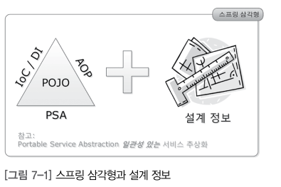

# chapter07 - 스프링 삼각형과 설정 정보

## 정리 && 요약

### Ioc/DI 제어의 역전 의존성 주입

+ 전체가 부분을 의존한다 / 집합관계 와 , 구성관계
+ A가 B를 사용한다 - > A가 B를 의존한다.
+ 의존성 주입은 , 생성자, 속성 , xml , autowird, resource가 있음
+ autowird 는 타입우선 Resource는 Id 우선  -> Reousrce는 자바 표준 어노테이션 프레임워크 교체시 유용

### AOP

 + 스프링 프레임워크를 학습하는 것에 대해.
 + Ioc/DI , AOP , PSA 스프링의 3대 프로그래밍 모델 이해가 필 수 이다.
 

## Ioc/DI 제어의 역전 의존성 주입

 + 전체가 부분에 의존한다고 표현함.
 + 더 깊이는 의존하는 객체와 의존되는 객체 사이에
 + 집합관계(Aggregation) 와 구성 관계 (Composition)로 구분 함
 + 전체가 부분에 의존한다! 프로그래밍에 의존관계는 new로 표현된다 기억!
 + A가 B를 사용한다 - > A가 B를 의존한다.

 + 자바 코드로만 표현한 의존성 주입.
 + 주입이란? 외부에서 주입을 한다. 

 + 생성자를 통해서 주입을 하는 예제 코드
 + 어떤 Tire 구현체가 들어와도 실행되고, 확장성이 좋아짐.
 + 지금까지 의존성 주입은 전략패턴 응용 
 + 전략 : 구현체 : 컨텍스트 : tire 브랜드 사용하는 매서드 등..

 + 의존성 주입 종류 : 생성자주입, 속성 주입(setter) , xml(xml 파일 만 교체해주면되서 편리.) , autowird

## Autowird

 + 타입 기준 매칭
 + id 보다 타입을 우선시 한다.

## Resource

 + 자바 표준 어노테이션
 + 오토와이어드와 달리 id가 우선순위다.

## AOP - Aspect? 관점? 핵심 관심사? 횡단 괌신사?

 + Aspect-Oriendted Programming 관점 지향 프로그래밍
 + 로직(Code) 주입 

 + 횡단 관심사.
 + 코드  = 핵심관심사 = 횡단 관심사

 + AOP 적용 예제 코드
 + @Aspect  클래스를 AOP에 사용하겠다 -> 공통관심사를 처리하겠다.
 + @Before 대상 메서드 실행 전에 이 메서드를 실행함 .
 + JointPoint @Before에서 선언된 메서드인 RunSomthing() 의미 

 + AOP는 인터페이스 기반.
 + AOP는 프록시를 사용해 실제 메서드를 호출한다.

### 요약

 + 스프링 AOP는 인터페이스 프록시 런타임 기반이다.

### 용어

### Pointcut 자르는 지점 Aspect 적용 위치 지정자 .

 + *runSomething -> pointcut
 + @Before("execution (* runSomething())) ? -> 지금 선언하고있는 public void before) 기울어진 볼드체 부분의
 + 메서드 (* runSomething()가 실행 되기전 @Before에 실행하라는 의미다. 여기서 public void before는 횡단 관심사를 실행하는 메서드
 + 결국 Pointcut은 -> 횡단 관심사를 적용할 타깃 메서드를 선택하는 지시자(메서드 선택필터)
 + 또는 줄여서 타깃 클래스의 타깃 메서드 지정자라고 함.

 + PointCut 예제

### joinPoint - 연결점? 연결 가능한지점.

 + Pointcut은 JoinPoint 부분 집합 
 + 스프링 AOP는 인터페이스를 기반 -> 인터페이스는 추상 메서드의 집합체 -> 스프링 AOP는 메서드에만 적용 가능하다는 결론.

 + Pointcut의 후보가 되는 모든 메서드들이 JointPoint 즉 Aspect 적용이 가능한 지점이 됨.
 + JointPoint란 Aspect 적용이 가능한 모든 지점을 말함.
 + Spring AOP에서 JoinPoint란 스프링 프레임워크가 관리하는 빈의 모든 메서드에 해당함.

 + romeo.runSomething() 메서드를 호출한 상태 -> JoinPoint = romeo 객체의 runSomething()메서드가 됨
 + JoinPoint 파라미터를 이용하면 실행 시점ㅁ에 실제 호출된 메서드가 무엇인지 실제 호출된 메서드를 소유한 객체가 무엇인지, 호출된 파라미터 무엇인지 정보확인가능.

### 정리

 + 광의의 JoinPoint란 Aspect 적용이 가능한 모든 지점이다.
 + 협의의 JoinPoint란 호출된 객체의 메서드다.

## Advice

 + Pointcut에 적용할 로직, 메서드 의미함. 여기서 + 언제라는 개념 포함.
 + 결론: Pointcut에 언제 무엇을 적용할지 정의한 메서드.

## Aspect- 관점? 측면? Advisor의 집합체

 + 여러 개의 Advice와 여러 개의 Pointcut의 결합체를 의미하는 용어
 + Aspect = Advice들 + Pointcut들
 + Advice는 언제 무엇을 의미
 + Pointcut은 어디에 를 의미
 + Aspect : 언제 어디에 무엇을 의미.

Advisor- 조언자? 어디서 , 언제 무엇을!

 + Advisor = 한 개의 Advice + 한 개의 Pointcut
 + 스프링 AOP에만 사용하는 용어

## PSA- 일관성 있는 서비스 추상화 

 + 일관성 있는 서비스 추상화 
 + 서비스 추상화 ex) JDBC
 + 데이터 베이스 종류 관계없이 같은 방식제어할수있는 이유 - 어댑터 패턴.
 + 어댑터 패턴을 적용해 같은 일을 하는 다수의 기술을 공통의 인터페이스로 제어할 수 있게하는 것을 서비스 추상화라 함
 + 스프링 프레임워크는 서비스 추상화를 위해 다양한 어댑터 제공
 + OXM(Object XML Mapping:객체와 XML 매핑) / ORM / 캐시 / 트랜잭션
 + 