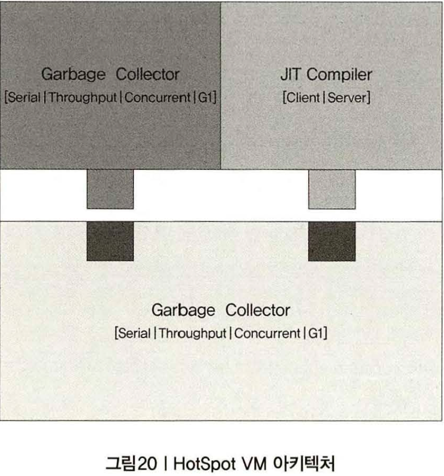
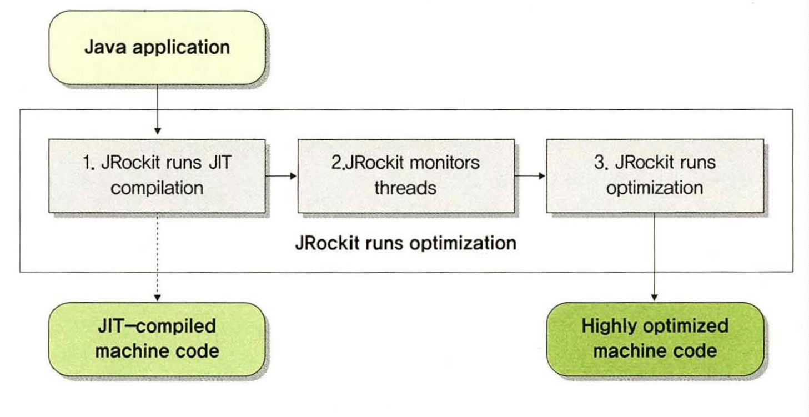
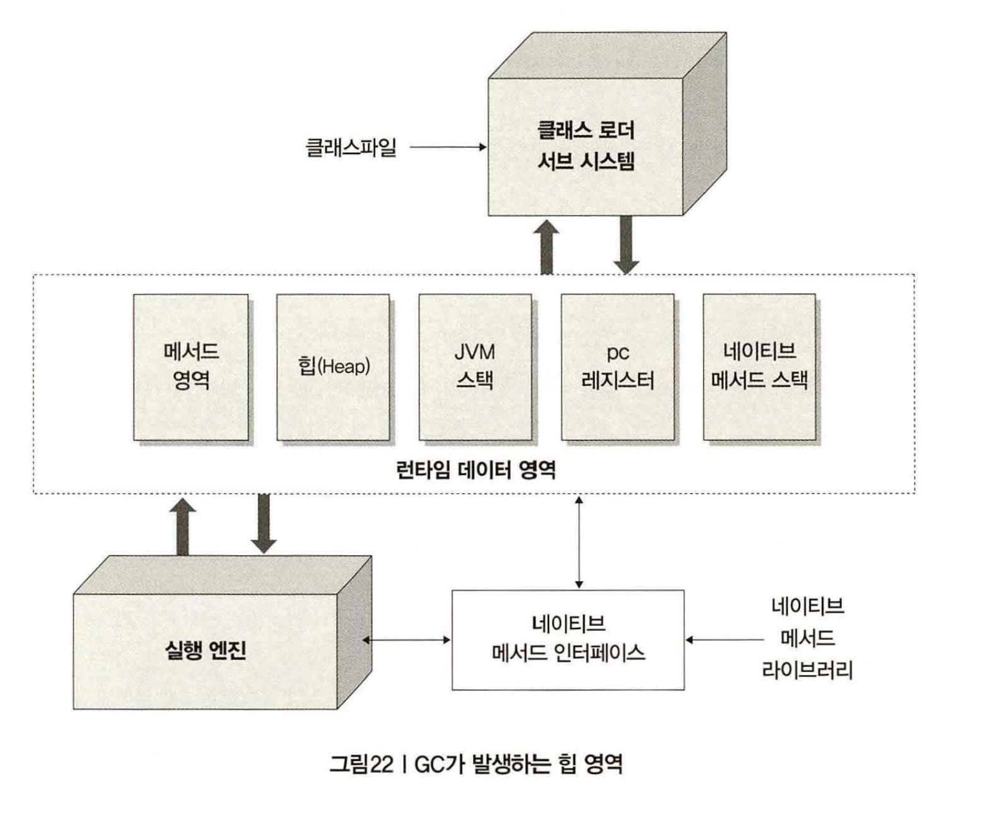
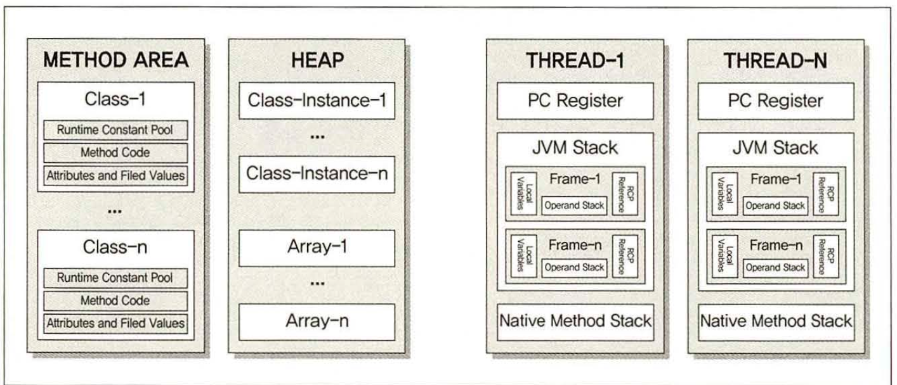

# 디자인패턴 꼭써야한다 - 01

## MVC

 + Model :  view에서 입력된 내용 저장 관리
 + Controller : view - model 연결자

## 패턴 

 + 무엇인가 만들기 위한 모델이나 가이드 , 설명의 집합
 + 즉 시스템을 만들기 위해 전체 중 일부 의미 있는 클래스들을 묶은 각각 집합을 디자인 패턴

### Transfer Object 패턴 

 + Value Object 로 불림 
 + 데이터를 전송하기 위한 객체에 대한 패턴
 + 보통 마이바티스에서 데이터 담는 객체 ? 이해 하면 편할듯 
 + Get / set 메서드를 만들지 않을때 성능상 더 빠름 
 + 이 패턴을 사용한다고, 성능은 좋아지지 않지만 - > 객체에 결과값을 담아 올 수 있어서 여러번 요청하는 일을 줄여 줌.

# 내가 만든 프로그램의 속도를 알고 싶다. - 02

 + 성능이 느릴 땐 병목 지점 파악하자

## 프로파일링 툴

 + 시스템 문제 분석 툴이라 이해 
 + ex) APM (Application Performance Monitoring / Management)
 + 프로파일링 툴 : 개발자 용 , 소스 레벨의 분석을 위하는 툴 , 애플리케이션의 세부 응답 시간까지 분석
 + 메모리 사용량을 객체나 클래스 소스의 라인 단위까지 분성  / APM에 비해 저렴 / 자바 기반의 클라이언트 프로그램 분석 할 수 있음

 
 + APM 툴 : 애플리케이션 장애 상황에 대한 모니터링 및 문제점 진단 주 목적
 + 서버의 사용자 수나 리소스 대한 모니터링
 + 실시간 모니터링을 위한 툴 / 가격 비쌈  / CPU 수 기반 가격 정해짐 / 자바 기반의 클라이언트 프로그램 분석 X

### 응답시간 프로파일링 기능 (프로파일링 툴 제공 기능)

 + 응답시간 측정 하기 위함.
 + 보통 CPU 시간과 대기시간 제공 .  
 + 하나의 메서드 한 라인 수행하는대 소요되는 시간은 무조건 CPU 시간과 대기 시간으로 나뉨

### 메모리 프로파일링

 + 잠깐 사용하고 GC의 대상이 되는 부분 찾거나 메모리 릭 발생 부분 찾기 위함.

## System 클래스

 + 배열 복사기능 있음.
 + System.nanoTime() 메서드는 나노단위로 현재시간을 리턴 / currentTimeMillis 보다 빠르다.
 + 나노타임 쓰는걸 권 (성능 측정할 떄)

### JMH

    @BenchmarkMode({ Mode.AverageTime })  // 평균 응답시간 측정
    @OutputTimeUnit(TimeUnit.MILLISECONDS)  // 시간 단위를 밀리초로

    public class CompareTimerJMH {

    @GenerateMicroBenchmark  // 측정 대상이 되는 메서드 선언 
    public DummyData makeObject() {
        HashMap<String , String> map new HashMap<String, String> (1000000);
        ArrayList<String> list = new ArrayList<String>(100000);
        return new DummyData(map,list)
        }
    }

# 왜 자꾸 String을 쓰지 말라는 거야 - 03

  + String은 메모리 낭비
  + StringBuffer / StingBuiler를 사용하면 메모리 낭비가 적고 성능적으로 훨씬 우수함.
  + 두 클래스는 CharSequence 구현체임  CharSequence로 받아서 처리하면 메모리 효율에 더 좋음.

## String vs StringBuffer  vs StringBuilder

 + String : 짧은 문자열 더할때
 + buffer : 스레드에 안전한 프로그램이 필요할때, 스레드에 안전한지 모를경우 사용 ex) singleton 클래스 OR static 선언 문자열
 + builder : 스레드 안전한지여부 관계없는 프로그램 개발  Ex) 메서드 내에 변수를 선언하면 해당 변수는 메서드 내에만 살아있으므로 사용해도됨 .

### jdk 5.0

 + jdk 5.0 이상에서는 컴파일러가 자동으로 StringBuilder로 변환해줌. (책에 예시는 스트링 외에 다른 클래스가 섞여서 + 될경우..? ex) "hello" + 1 이런식 int가.. )
 + 다른 사람 코드를 보니 순수 문자열 "hi"  + "test" 이런거는 치환이 안돼고, "hi" + str(String str="1111") 이런거는 빌더로 치환됨 .
 + 허나 반복 루프를 사용해서 문자열 더할때는 객체를 계속 추가한다는 사실이 변함없으므로 String 클래스를 지양하자 (bulider OR buffer도 자동치환경우 새로운객체를 매번 생성함.)
 + 마지막으로 자동치환을 해도 어짜피 문자열을 더할때 객체를 계속 생성하므로 String으로 많은 문자열 더하는건 지양을 하자 .

# 어디에 담아야 하는지 ..  - 04

## List 

 + Vector : 객체 생성시 크기를 지정할 필요 없는 배열 클래스 
 + ArrayList : vector 비슷 동기화처리 X
 + LikedList : ArrayList 동일  Queue 인터페이스 구현했기때문에 FIFO 작업 수행 
  
 + 데이터를 넣는 속도는 차이가 없음 (LikedList는 Peek() 순차적으로 결과받아오는 메서드 사용)
 + Vector는 동기화 선언때문에 다른스레드 접근을  막아서 느림.
 + 

## Map

  + HashTable: 데이터를 해쉬 테이블에 담음 -> 내부에서 관리하는 해쉬테이블 객체가 동기화 되있어서 , 동기화가 필ㅇ한 부분에서 사용
  + HashMAp : 데이터를 해쉬 테이블에 담는 클래스, 다른점은 null 값 허용 동기화되어있지않음
  + TreeMap: red-black 트리 키에 의해 순서 정해짐.
  + LinkedHashMap : HashMap 동일 이중 연결 리스트 방식 사용하여 데이터 담음 (앞뒤로 노드에 대한 링크정보 가지고 있음)

## Queue

 + 선입 선출

### List 보단 왜 Queue?

 + List는 데이터 삭제시 쉬프트 때문에 처리시간이 길어짐. (데이터가 많을 수록 지우는데 소요시간이 증가됨.)
 + Queue 구현체 : LinkedList / PriorityQueue (추가된 순서와 상관없이 먼저 생성된 객체가 먼저나오는 큐)

## Set 

### 누가 가장 빠름?

 + hashSet / LinkedHashSet 
 + TreeSet : 가장 느림 , 데이터를 저장하면서 정렬함  즉 데이터를 순서에 따라 탐색하는 작업일때는 TreeSet이 좋음

# for 루프를 더 빠르게 - 05

 + if문을 쓴다고 큰 성능저하가 많이 일어나지않음
 + if 보단 case문이 가독성이 좋아 숫자분기땐 권장 허나 조건이많으면 좋지 않다. 시간이 오래걸리니

### 반복문 주의사항

 + for(int loop=0jloop<list.size()jloop++) -> 계속 size함수를 호출하게된다..
 + int listSize = list.size()로 해주고 for문 돌려 주자. (근데 실제로 차이별로안나는 거같음)
 + for-each 문은 For문보다 느리다.
 + 반복문을 돌릴때 함수가 계속 호출되는것을 지양하자.

# static 제대로 한번 써보자 - 06

 + 자주 사용하고 절대 변하지않는 변수로 Final static 선언
 + 보통 변수에 선언하면 요청할때마다 계속 불러야되지만
 + 스태틱을 사용하면 한번만 하면 그 다음엔 안불러도되서 읽기전용일때 속도가 빨라짐 
 + 읽기전용으로 쓰지않고 계속 바뀌는 값으로 static을 선언하면 여러 스레드가 접근시 심각한 오류를 발생 시킬 수 있음
 
## 메모리 릭.

 + 이미 알고 있는 스태틱으로 선언된 리스트나 배열등에 값을 추가하면 ??? 릭 발생

# 클래스 정보 - 07

## reflection 

 + 이 패키지에 있는 클래스들은 JVM에 로딩되어 있는 클래스와 메서드 정보 읽어 올 수 있음.

## class 클래스

 + 생성자는 따로없고, 클래스에 대한 정보를 얻을 때 사용
 + Object 클래스에 있는 getClass() 메소드를 이용하는 것이 일반적

## Method 클래스

 + 메서드에 대한 정보를 얻을 수 있음
 + 생성자가 없음으로 Class getMethods()  / GetDeclaredMethod() 메서드를 써야함.

## Field 클래스

 + 클래스에 있는 변수들의 정보 제공을 위해 사용됨 .

## reflection 관련 클래스 잘못사용하면 ?

 + if (src.getClass().getName().equals("java.math.BigDecimal")) {
 + 미미하지만 성능의 영향을 주긴함 하나하나 모이면 .. instanceof 사용이 더빠를걸..

    public String checkClass(Object src) {
    if (src instanceof java.math.BigDecimal) {
    // 데이터 처리
    }

## 정리

 + 클래스의 메타정보는 JVM Perm 영역에 저장됨 . 

# synchronized는 제대로 알고 쓰자 - 08

## 스레드 

 + 프로세스와 스레드는 1:다  관계 
 + 프로세스에서 만들어 사용하고있는 메모리를 공유.

## Thread / Runnable

    class RunThreads {
        public static void main(String[] args) {
            Runnablelmpl ri = new Runnablelmpl ();
            Thread Extends Thread ThreadExtends();
            new Thread (ri).start();
            te.start();
        }
    }

## sleep(), wait(), join

 + 진행중인 스레드를 대기하기 위한 메서드.
 + 3가지 메서드 모두 예외를 던지도록 되어 있어 반드시 예외 처리 해줘야 됨. 

### sleep()

 + sleep(long millis) : 명시된 Ms 만큼 해당 스레드 대기. 정적 메서드임
 + sleep(long millis, int nanos) : 명시된 Ms + 나노시간만큼 해당 스레드 대기. 정적 메서드

### wait()

 + 모든 클래스의 부모 클래스인 Object 클래스에 선언되 있음 , 어떤 클래스도 사용 가능,
 + 명시된 만큼 스레드 대기.
 + sleep 과 다른점은 매개 변수 , 아무런 매개 변수를 지정하지않으면 notify/nofityAll 매서드가 호출될때 까지 대기함.

### join()

 + 메서드는 명시된 시간만큼 해당 스레드가 죽기를 기다림.
 + 아무런 매개변수 없으면 죽을때 까지 계속 대기.

## interrupt(), nofify(), notifyAll()
 
 

### interrupt()

 + 앞서 3개 메서드를 모두 멈출 수 있는 유일한 메서드는 interrupt()
 + 호출되면 중된 스레드는 InterruptedException 발생 
 + 수행확인은 interrupted() / isInterrupted() 메서드 
 + 전자는 스레드의 상태를 변경 , 후자는 상태만 리턴.
 + isAlive() 스레드 생존 여부 확인 . 

### notify() / notifyAll()

 + wait()를 멈추기 위한 메서드.
 + 전자는 객체의 모니터 관련 단일 스레드를 깨우고
 + 후자는 객체의 모니터와 관련있는 모든 스레드를 깨운다.

## interrupt() 메서드는 절대적인 것이 아님

 + Interrupt() 메서드 호출하여 특정 메서드 중지시키려할때 
 + 항상 멈추는 것은 아님.
 + interrupt() 메서드는 해당 스레드가 block 되거나 특정 상태에만 동작함.
 + 그래서 중간에 sleep 을넣어주거나 계속되는 스레드를 잠시 멈출때 작동함.

    public void run() {
                while (flag) {
                value++ j if (value == Integer.MAX_VALUE) {
                value = Integer.MIN_V ALUEj System.out.println("MAX_V ALUE reached! ! !") 
                    try {
                    Thread.sleep(0, 1) j
                    } catch (Exception e) {
                    break
                    }
            }
        }
    }

## synchronized 이해

 + 동사 : 동시에 일어나다 , 동시에 진행하다.
 + 하나의 객체에 여러 객체가 동시에 접근 처리하는 상황이 발생할때 사용함.
 + 천천히 한명씩들어 와! 메서드나 블록을 제어 .

### 언제 사용해 ?

 + 하나의 객체를 여러 스레드에서 동시 사용할 경우나
 + static으로 선언한 객체를 여러 스레드에서 동시에 사용할 경우에 사용해야됨 .

## 동기화 - 동일객체 접근 시

 + 필요한 부분에만 동기화를 사용해 성능을 줄이자

## 동기화 - static 사용시 

 + 클래스 변수에 값이 일정하지않음 -> 메서드도 클래스 메서드를 참조하도록 static 

    public class ContributionStatic {
    private static int amount = 0;
    
        public static synchronized void donate() {
        }
    
        amount++;
    
        public int getTotal() {
            return amount;
        }
    }

## 동기화를 위해 자바에서 제공하는 것.

### java.util.concurrent

 + LOCK : 실행 중인 스레드를 간단한 방법으로 정지시켰다 실행함, 상호 참조로 데드락 피함
 + Executors: 스레드를 더 효율적을 관리하는 클래스들 제공 / 스레드 풀도 제공
 + Concurrent 콜렉션 : 앞서 살펴본 콜렉션의 클래스들 제공
 + Atomic 변수: 동기화가 되어있는 변수 제공 , 사용시 synchronized 식별자를 메서드에 지정할 필요없이 사용

## JVM내 Synchronization 동작

 + 자바의 HtoSpot VM은 자바 모니터를 제공함으로서 스레드들이 상호 배제 프로토콜에 참여하게 돕는다.
 + 자바 모니터는 잠기거나 풀린 상태중 하나이며 , 동일한 모니터에 진입한 여러 스레드들 중 한 시점에는 단 하나의 스레드만 모니터 가짐
 + 정리 -> 모니터를 가진 스레드만 모니터에 의해 보호되는 영역에 들어가 작업
 + 보호되는 영역 -> synchronized  
 + jdk 5 부터 XX:+UseBiasedLocking 옵션을 통해 biased locking 기능 제공.
 + 그 전까지는 대부분의 객체들이 하나의 스레드에 의해 잠기게 됬지만 , 이 옵션은 스레드가 자기 자신을 향하여 bias 됨
 + 즉 이 상태가 되면 스레드는 많은 비용이 드는 인스트럭션 재배열 작업을 통해 잠김과 풀림 작업을 수행함. -> 진보된 적응 스피닝 기술을 사용해 처리량 개선한다 함.
 + 동기화 성능이 보다 빠라짐.

# IO 에서 발생하는 병목현상 - 09

 + 잘못 사용하면 응답속도에 영향을 주는 부분 .

## 기본적인 IO 처리

 + 기본적으로 버퍼없는 FileReader 보단 BufferedReader 사용이 성능이 훨씬 빠르다

## IO에서 병목이 발생한 사례

 + 한번씩 요청할때마다 수정되었는지 확인하고 만약 수정 되어있으면 설정파일을 불러오는 코드.
 + 설정파일을 다시 읽을지 여부에만 2.2초가 소요 됨. 
 + 데몬 스레드를 활용하여 5분이나 10붅에 한번씩 확인하도록 수정. 
 + 한번 요청할 대마다 수정여부 확인하지 않아도됨.

## NIO의 원리 

### 기존 IO

 + 파일 읽어! 메서드를 자바에 전달 
 + 파일명 전달받은 메서드 운영체제 커널에 파일 읽어 요청
 + 커널이 하드 디스크로 부터 파일 읽어서 자신의 커널에 있는 버퍼에 복사작업 수행 DMA에서 함
 + 자바는 마음대로 커널 버퍼사용못해서 JVM에 전달
 + JVM에서 메서드에 있는 스트림 관리 클래스 사용하여 데이터 처리

 + 3 ~ 4번 작업시 수행할때 대기시간이 발생함 .
 + 단점 보완을 위한 NIO 탄색

### NIO 추가 개념들

 + 버퍼도입
 + 채널의 도입
 + 문자열 엔코더 디코더 제공
 + Perl 스타일의 정규 표현식 기초한 패턴 매칭 방법 제공
 + 파일잠그거나 메모리 매핑이 가능한 파일 인터페이스 제공
 + 서버를 위한 복합적인 Non-blocking IO 제공
 
 + 자세한건 http://docs.oracle.com/javase/1.4.2/docs/guide/nio/

## DirectByteBuffer 잘못 사용시 문제 발생 사례

 + NIO 사용할 때 ByteBuffer 많이 사용함, 네트워크나 파일에 있는 데이터를 읽을 때 사용
 + 이중 allocateDirect()는 OS 메모리에 할당 된 메모리를 네이티브한 JNI로 처리하는 다이렉트 바이트 퍼퍼 객체 생성
 + 근대 이객체는 필요할때 계속 생성하면 안됨
 + 다이렉트 바이트 버퍼 생성자에는 -> Bits라는 클래스의 reserveMemory() 메서드를 호출하는데
 + JVM에 할당된 메모리보다 더많으 메모리 요구할경우 System.gc() 호출해 항상 가비지 컬렉터가 동작함 

## lastModified() 메서드 성능 저하

 + Watch 클래스를 활용해 파일을 쉽게 모니터링 하자

# 로그는 반드시 필요한 내용만 찍자 - 10

## System.out.println() 문제점

 + sout 를 사용하면 응답시간이 늘어나고
 + logger 및 sout를 제거시 개선율 146프로 증가.
 + sout 사용을 지양해야된다.

 + 콘솔에 로그를 남기면? -> 뒤에 프린트하는 부분 대기.
 + 대기 시간이 발생하기 때문에 성능이 좋지않다.
 + 더 큰 문제는 sout는 개발할때만 사용 된다 . 운영될땐 사용되지도,, 볼수도 없는  디버그용 로그를 서버에서 고스란히 처리하니 문제.
 + 의미없는 디버그용 로그가, 수백 수천번 사용되기때문에 아까운 서버의 리소스와 디스크가 낭비된다.
 + 적절한 로거를 사용해 데이터를 쌓는건 좋지만 sout 로그는 적절하지 않다.

## System.out.format() 메서드

 + 사용시 Object 배열을 생성하여 그 값을 배열에 포함시키도록 설계
 + 디버그용으론 적합하지만 운영용으론 X

## 로그를 간결하게 처리하는 법 

 + Logger 사용하여 처리하는 것. 
 + 하지만 힘든 상황이면 ?
 + 자체 로거 클래스 만드는법 / 시스템 로그를 컴파일 할때 삭제.
 + 전자보단 이미만들어져있는게 더 효율이 좋다.
 + 삭제하는 법을 알아보자.

 + public static final boolean printFlag = false;  이렇게해두면 전역으로 사용해
 + 운영시 false로만 바꿔두면 좋다. 허나 매번 If 문으로 감싸야되서 불편함.

 + logger 클래스를따로만들어 public static void log(String message)  만들고 위에 true false 만 해줘서 사용하면 좋긴하다.
 + 허나 Flag를 수정하기위해 다시 컴파일 해야됨 ... 

## 로거 사용시 문 제점

 + 로그를 프린트하든 하지않는 로그를 삭제하기위해 객체를 생성해야됨..
 + 로그 메세지는 간단한 문자든 쿼리든 상관없이 하나 이상 객체 필요함.,
 + 그러면 그 객체를 생성하는데 메모리 시간이 소요 됨.. 그러면 GC도 수행해야하고 ..

    if(logger、.isLoggable(Level.INFO)) { //로그처리
    }

 + 불필요한 메모리 사용 줄일 수 있음, 

## 로그를 깔끔하게 처리해주는 slf4j와 LogBack

    logger.debug("Temperature set to {}. Old temperature was {}.", t , oldT)j

 + 간단히 로그를 처히재누느 프레임 웤
 + 기존 로거들은 앞절에 문자열을 더해 전달해주는 방식.
 + slf4j는 format 문자열에 중괄호를 넣고 그 순서대로 출력하고자하는 데이터를 콤마로 구분해 전달함.
 + 이렇게 해주면 로그를 출력하지 않을 경우 필요 없는 문자열 더하기 연산은 발생하지 않음.
 + 또한 자바의 기본 로거를 비롯해 ,Log4j, 아파치 commons로깅등과 연계하여 사용하도록 되어 있음.

## 예외 처리는 이렇게

 + e.prìntStackTrace()j 일반적으론 이렇게 처리함.
 + 스택 정보를 확인하고 확인된 정보를 콘솔에 프린트하지만...
 + 알아보기가 힘듬, 콘솔에 로그를 프린트하면 데이터가 섞이기 때문..
 + 예외 스택정보는 또한 100개까지 프린트해서 성능에도 많은 부하를 줘버림.
 + 그래서 임의로 만든 예외 클래스에서 원하는 스택정보를 가공하여 메시지를 처리하자..

    
    catch (Exception e) {
    StackTraceElement[] ste=e.getStackTr‘ace();
    String className=ste[Ø].getClassName();
    String methodl\lame=ste[Ø].getMethodName();
    int lineNumber‘=ste[Ø].getLineNumber‘();
    String fileName=ste[Ø].getFileName();
    l ogger.severe("Exception "+e.getMessage());
    logger. sever‘e(className+"."+methodName+" "+fileName+" "+lineNumber+"
    line");

## 정리

 + 필요한 내용만 처리를 하고
 + Log4j slf4j, LogBack 과 같은 로거를 사용하자.

# JSP와 서블릿, Spring에서 발생할 수 있는 여러 문제점 - 11

 + 자바기반 시스템중 WAS에서 병목현상이 발생하는 부분을 나누면?
 + UI 부분과 비즈니스 로직  -> 여기서 UI는 서버에서 수행되는 UI

## JSP와 Servlet의 기본적인동작 원리는 꼭 알아야 한다.

 + jsp 처음 호출된 경우만 시간이 소요  -> 그 이후 컴파일된 서블릿 클래스가 수행 

### 서블릿 라이프 사이클

 + WAS JVM tlwkrgndpsms
 + Servlet 객체가 자동으로 생성되고 초기화 / 사용자가 해당 Servlet을 처음으로 호출했을 때 생성되고 초기화 된다. -> 계속 사용 가능 상태 
 

## 스프링 프레임워크 간단 정리 

 + 스프링을 사용하면 HttpServlet 확장하지 않아도 웹 요청 처리 가능.
 + 여러가지 기반을 POJO로 개발 가능 .

### 스프링을 사용하면 발생하는 문제점 

 + 프록시 관련된 부분이 성능 문제가 가장 많이 발생함
 + 특히 AOP 개발자가 직접작성한 코드는 예상하지 못한 성능문제를 보일 가능성이 높다. 성능적인 면을 테스트 해야됨 .
 + 리턴 타입경우 return "redirect:/member" + id도 주의 해야함

 + 문자열 자체를 리턴하면 매번 동일한 문자열을 대한 뷰객체를 실제로 찾기보단 , 이미찾아본 뷰 객체를 캐싱해두는게 더 좋다.
 + InternalResourceViewResolver 에 그러한 캐시기능 내장 
 + return new RedirectView(“fmemberl" + id);

# DB를 사용하면서 발생 가능한 문제점들. - 12

 + DB Connection Pool -> Connection 객체를 생성하는 부분에 대기시기간을 줄이고 네트워크 부담을 줄여줌
 + 안전하고 검증된 WAS에서 제공하는 DB connection  Pool 이나 Datasource를 사용하자
 + DataSource는 DB Connection Pool을 포함함  -> 자바 표준이 지정되있는것이없고 DataSource는 WAS 상관없이 자바 표준임으로 사용법 동일
 + DB connection Pool  연결관리 트랜잭션 관리하도록 만들어야함.

 + Statement / PreparedStatement 차이점은 캐시 사용여부
 + 쿼리문장분석 -> 컴파일 -> 실행
 + 전자는 1~3단계 다거치지만 후자는 한번 실행후 캐시에 담아서 재사용 

## DB 사용할때 항상 닫아야 되는 것.

 + ResultSet, Statement , Connection 
 + ResultSet 닫히는 경우 -> Close(), GC, 관련된 Statement 객체의 close()메서드 호출되는 경우 .
 + 닫는이유? 자동으로 호출되기전 DB와 JDBC 리소스를 해제하기위해 -> 빨리 해제해야 DB서버의 부담이 적어진다.

 + Connection 닫히는 경우는 위를 제외하고  치명적인 에러가 발생했을 때 닫힘.
 + 연결을 닫아야하는이유? 지정된 갯수만큼 연결하고 필요할때 증가 되는 최대값 지정하도록 됭 ㅓ있음.
 + 만약 꽉차면? 대기를 한다 그러다 시간이 지나면 오류 발생, 그래서 반드시 닫아줘야됨 .
 + GC가 될 때 까지 기다리면 커넥션 풀이 부족해짐.
 + 항상 finally 에서 닫아 주자.

## AutoClosable 인터페이스

 + Try-with-resource 문장으로 관리되는 객체에 대해 자동적으로 close() 처리.
 + InterruptedException을 던지지않도록 하는 것을 권장
 + 이 close()메서드를 두번 이상 호출할 경우 뭔가 눈에 보이는 부작용이 나타나도록 해야함

    
    try(BufferedReader br = return br.readLine()j

 + 이런 식으로 소괄호 안에 close 메서드를 호출하는 객체를 생성해 간단히 처리 가능함.
 + 별도로 finally 블록에서 close 메서드를 호출할 필요가 없음 

## JDBC를 사용하면서 유의할 만한 몇 가지 탑

 + setAutoCommint() 메서드는 필요할 때만 , 여러개의 쿼리 동시작업시 성능에 영향줌
 + 배치성 작업은 executeBatch() 메서드 사용 

# XML 과 JSON 잘 쓰자

## JSON 과 파서들

 + name / value 형태의 쌍으로 collection 타입
 + 값의 순서가 있는 목록 타입

 + 많은 CPU 메모리 점유해 응답시간이 느림.
 + JSON 파서 종류 - > Jackson Json / google -gson 
 + 직렬화 역직렬화 성능이 좋지않음...

## 데이터 전송을 빠르게하는 라이브러리 소개

 + 자바 객체를 전송하는 방식이 많이 사용됨
 + 서버와 서버간 서버와 클라이언트 사이에 데이터를 주고받기위해
 + 어떤라이브러리를 사용할지 대해서는 성능 비교를 통해 사이트에 가장 적합한 라이브러리 선택하는게 좋음 .

# 서버를 어떻게 세팅해야 할까 ? - 14

## 설정대상 

 + 성능테스트를 통해 병목지점을 파악하자.
 + 웹 서버 세팅 / WAS 서버 세팅 / DB 서버 세팅 / 장비 세팅 

## 아파치 웹 서버의 설정 

 + 정적인 부분을 처리해야되는 웹 서버
 + 아파치 웹 서버 설정 바꾸는 방법 
 + conf -> httpd.conf 파일 수정 

### ThreadsPerChild

 + 수치가 적게 되있음 늘려 줘야햄 서버가 더 많은 사용자의 요청을 처리함

### MaxRequestsPerChild

 + 최대 요청 개수 지정 부분 0 이면 제한을 두지 않겠다는 의미 
 + 가급 적이면 0 으로 .

## 웹 서버의 Keep Alive 

 + HTTP 연결을 맺었다 끊었따 작어 빤복
 + 초기화면에 이미지와 , css , 자바스크립트 등 파일을 받아야 되는 사이트에선
 + 매번 접속해야되는 상황이와서 이 옵션은 두개 정도의 연결을 열어 끊지않고 재사용하기 때문에 응답속도가 빨라짐
 + keepAlive-Timeout 설정을 같이 사용하는대 끊기는 시간을 설정하기 위한 부분 . 
 + 마지막 연결이 끊난후 다음 연결이 될때까지 얼마나 기달리지 .

## DB Connection Pool 및 스레드 개수 설정

 + 가장 선응에 영향을 주는 DB Connection Pool  / 스레드 갯수
 + 많이 사용할 수록 메모리를 점유함. 적게하면 대기시간이..
 + 전자 개수는 개발자용경우 최소치로 / 많으면 많을수록 서버기동시 시간이 오래 소요된다.
 + 운영중에는 최소 최대값은 동일한게 좋음  -> 사용자가 갑자기 증가? DB Connection Pool 개수도 증가되어야하고
 + 증가할때 대기시간 발생확률이 큼. 
 + 보통 Connection Pool 40~50 스레드는 + 10 
 + 스레드 개수가 적으면 적은 만큼 수의 연결은 필요 없어서 .. 
 + 스레드는 입구 / DB Connection Pool은 출구

 + 스레드가 더많아야 되는이유는 ? 모든 화면이 DB 접속하는게 아니기 때문.. 콘솔을 사용한다던지..
 + 그래서 여유분을 갖는다.

 + DB Connection Pool 개수를 넘어서면? 대기시간 발생.
 + 시간도 너무 짧지도 너무 길지도않게(디폴트 20초) 설정해줘야 하는데 어려움...? 너무 짧으면 쥐씨순간... timeout 뿜뿜..

# WAS 인스턴스 개수 설정

 + 늘리면 늘릴수록 CPU 과부화
 + 보통 1~2개의 cpu당 하나의 인스턴스 지정 .

## 세션 시간 설정.

# JVM은 도대체 어떻게 구동 될까?  - 16

## HotSpot VM 구성

 + Java HotSpot Performance Engine
 + 자바의 성능을 개선하기위해 JIT(Just In Time)  개발 이름은 핫스팟
 + 프로그램의 성능에 영향을 주는 지점에 대해 지속적으로 분석 

 + VM 런타임 / JIT 컴파일러 / 메모리 관리자 세 가지 컴포넌트로 구성 됨.

 + HotSpot VM 아키텍처 그림. 
 + 핫스팟 VM 런타임에 GC방식과 JTI 컴파일러를 끼워 맞춰 사용할 수 있음.

## JTI Optimizer?

 + javac 컴파일러는 소스코드를 바이트 코드로된 class 파일로 변환해 줌.
 + JVM은 항상 그래서 바이트 코드로 시작함.
 + JIT는 애플리케이션에서 각각의 메서드를 컴파일할 시간이 별로 없다
 + 모든 코드를 초기에 인터프리터에 의해 시작되고 / 해당 코드가 많이 사용되면 컴파일 대상이 됨.
 + HotSpot VM에서 이 작업은 각 메서드에 있는 카운터를 통해 통제되며 , 메서드에는 두개의 카운터가 존재

 + 수행 카운터 : 메서드를 시작할 때마다 증가
 + 백에지 카운터 : 높은 바이코드드 인덱스에서 낮은 인덱스로 컨트롤 흐름이 변경될 때마다 증가

 + 백에지 카운터는 메서드가 루프가 존재하는지 확인할때 사용됨. 수행 카운터보다 컴파일 우선 순위가 높다.
 + 인터프리터에 의해  카운터들이 증가 될때마다 한계치에 도달했는지 확인하고 컴파일을 요청함.
 + 컴파일 요청 -> 컴파일 대상 목록 큐 -> 컴파일러 스레드 가 큐를 모니터링

### HotSpot VM OSR( On Stack Replacement) 

 + 컴파일이 완료된 상태에서 최적화되지 않는 코드가 수행되는 것을 발견하면 컴파일 코드로 변경함.
 + 이 작업은 인터프리터에서 시작된 오랫동안 지속되는 루프가 다시 불리지않는 경우거나 , 루프가 끝나지 않고 지속적으로 수행되고 잇을 경우큰 도음이 된다.

## JRockit의 JIT 컴파일 및 최적화 절차

 + 최적화 절차
 

### JRockit runs JIT compliation

 + JIT 컴파일 실행 단계
 + 이 단계 실행후는 컴파일 된 코드 호출해서 빨라짐.
 + 시작할땐 성능이 느리지만 지속적인 수행은 빠른 처리 가능. 그래서 시작할 때 시간이 너무걸리기 때문에 모든 메서드를 최적화하지 않음. 

### Rockit Monitors threads

 + sampler thread라는 스레드가 존재하며 주기적으로 애플리케이션 스레드 점검.
 + 어떤 스레드가 동작중인지 여부와 수행 내역 관리. 어떤 스레드가 많이 사용되는지 확인해 최적화함.

### JRockit JVM Runs Optimization

 + sampler thread가 식별한 대상 최적 화.  백그라운드에서 진행되서
 + 수행중인 애플리케이션 영향 주지 않음. 

## IMB JVM JIT 컴파일 및 최적화 절차

 + 인라이닝
 + 지역 최적화
 + 조건 구문 최적화
 + 글로벌 최적화
 + 네이티브 코드 최적회

## 클래스 로딩 절차

 + 주어진 클래스의 이름을 ㅗ클래스 패스에 있는 바이너리로 된 자바 클래스 찾음
 + 자바 클래스 정의
 + 해당 클래스를 나타내는 Java.lang 패키지의 Class 클래스의 객체를 생성
 + 링크 작업 수행 
 + 클래스 초기화 진행. 

# GC 는 언제 발생? - 17

## GC 란?

 + 쓰레기 객체를 효과적으로 처리하는 작업

## Runtime data area 구성 

 + PC 레지스터 / JVM 스택 / 힙 / 메서드 영역 / 런타임 상수 (풀) / 네이티브 메서드 스택
 + 힙영역에서 GC 발생

## 힙 메모리

 + 클래스 인스턴스 , 배열이 메모리에 쌓임 / 공유 메모리라 불리며 여러 스레드에서 공유되는 데이터 저장됨.

## 논 힙 메모리

 + 자바의 내부 처리위해 필요한 영역 주된 영역은 바로 메서드 .

### 메서드 영역
 + 메서드 영역은 모든 JVM 스레드에서 공유
 + 저장되는 데이터들은 다음과 같음
 + 런타임 상수 풀: 자바의 클래스파일에는 contant_pool 이라는 정보가 포함
 + 이 콘탠트 풀에 대한 정보를 실행시 참조하기 위한 영역.  / 실제 상수 값도 포함되고 실행 시 변화게되는 필드 참조 정보도 포함

 + JVM 스택 : 스레드가 시작할 때 JVM 스택생성
 + 메서드가 호출되는 프레임이 저장 된다. 지역 변수 / 임시 결과 메서드 수행과 리턴에 관련된 정보 포함
  
 + 네이티브 메서드 스택 : 자바 코드가 아닌 다른 언어로 된 코드를 실행할때 스택 정보 관리

 + Pc 레지스터 : 자바의 스레드들은 각자의 레지스터를 갖는다 -> 모든 자바 코드들이 수행될때 JVM의 명령어 주소를 PC 레지스터에 보관

## GC 란?

 + 메모리 할당
 + 사용중인 메모리 인식
 + 사용하지않는 메모리 인식 

 + 사용하지 않는 메모리 인식 작업을 수행하지 않는다?
 + 할당한 메모리 영역이 꽉차 JVM에 행(서버가 요청을 처리못함 상태)이 걸리거나 더 많은 메모리 할당하려는 현상 발생 .

## GC 동작 과정 -> 모르는 내용만

 + 객체의 크기가 큰 경우 바로 올드 영역으로 이동.

## 5가지 GC 방식

### 시리얼 콜렉터

 + 영 영역과  올드 영역이 시리얼(연속적) 처리, 하나의 CPU에서 사용
 + Old영역에 마크 스윕 콜렉션 알고리즘 -> 쓰이지 않는 객체 표시해 삭제하고 한 곳으로 모으는 알고리즘. 
 + old영역 이동 객체중 살아 있는 객체 식별(표시단계) - > Old영역의 객체중 쓰레기객체 식별(단일스레드로.. 스윕) -> 필요없는 객체 모으고 살아잇는거 한곳으로(컴팩션)
 + 대기시간이 많아도 크게 문제되지 않는 시스템에 사용함.

### 병렬 콜렉터

 + 스루풋 콜렉터 방식
 + 다른 CPU가 대시 상태로 남아 있는걸 최소화 
 + 많은 CPU 사용으로 GC 부하를 줄이고 처리량 증가 . 
 + Old영역에 Mark-sweep-compact 콜렉션 알고리즘 사용 

### 병렬 콤팩팅 콜렉터

 + 위와 다른점 Old영역에 새로운 알고리즘 사용
 + 표시단계: 살아있는 객체 식별 표시 -> 종합단계: 이전 GC 수행하여 컴팩션된 영역에 살아 있는 객체 위치 조사 (여러 스레드가 Old영역 분리하면서 훑는다. / GC에서 컴팩션된 영역을 별도로 훑는다)
 + -> 컴팩션 단계: 컴팩션을 수행함, 컴팩션 영역과 비어있는 영역으로 나뉨 

### CMS 콜렉터

 + 로우 레이턴시 콜렉터 힙메모리 클때 적합함.
 + 영 영역에 대한 GC는 병렬 콜렉터와 같다.
 + Old영역에서는 다름 

### 

 + 초기표시 단계 : 매우 짧은 대기 시간으로 살아 있는 객체 찾기
 + 컨커런트 표시 단계 : 서버 수행과 동시에 살아 있는 객체에 표시 해 놓는 단계
 + 재표시(리마크) 단계 : 컨커런트 표시단계에서 표시하는 동안 변경된 객체에 다시 표시
 + 컨커런트스윕 단계: 표시되어 있는 쓰레기를 정리하는 단계

 + 컴팩션 단계를 거치지 않는다.  그래서 빈공간 자주 발생

 + 2개 이상 프로세서 사용하는 서버에 적당  
 + 점진적인 방식을 지원해 영 영역에서 GC를 더 잘게 쪼개 서버 대기시간 줄임.

### G1 콜렉터

 + region (구역) 으로 나누어짐.
 + 각 구역은 에덴, 서바이버, 올드 영역의 역할을 변경해가면서 하고 Humongous라는 영역 포함

### 동작

 + 며개 구역을 선정하여 영 영역으로 지정
 + 구역에 객체가 생성되면서 데이터 쌓임
 + Young영역 으로 할당된 구역에 데이터가 꽉 차면 GC 수행
 + GC를 수행해서 살아 있는 객체들만 Survivor 구역으로 이동 
 + 살아있는 객체들의 이동된 구역은 새로운 Suvivor 영역이 됨 
 + 몇 번의 에이징 작업을 통해 Suvivor영역에 객체가 young GC 후에도 살아 있으면 old로 승격됨.

### old 동작

 + 초기 표시 단계 (STW) : OLD 영역에 있는 객체에서 Survivor 영역의 객체를 참조하고 있는 객체 표시
 + 기본 구역 스캔 단계 : Old영역을 참조를 위해 Survivor 영역 훓는다. Young GC 발생하기 전에 수행
 + 컨커런트 표시 단계 : 전체 힙영역에 살아 있는 객체 찾음 만약 Young GC 발생하면 잠시 멈춤
 + 재표시 단계(STW) : 힙에 살아 있는 객체들의 표시작업을 완료 함. 
 + snapshot-at-the-beginning 알고리즘 사용 CMS GC 방식보다 빠름
 + 청소 단계 (STW) : 살아있는 객체와 비어있는 구역 식별, 필요없는 객체 지움 , 비어 있는 구역 초기화
 + 복사 단계(STW) : 살아 있는 객체들을 비어있는 구역으로 모음

# GC가 어떻게 수행되는지 보고 싶다. - 18

## jstat dhqtus 

+ gccapacity 각 영역의 크기를 알 수있어서 어떤영역은 크기를 늘리고 줄여야 할지 확인.
+ gcutil 힙 영역의 사용량을 보여줌 

## verbosegc 옵션

 + Young gC / full Gc  메모리변화 / 시간을 알수있다.

 + full GC후에도 메모리 사용량이 많으면 메모리 릭 의심. 

# GC 튜닝은 항상 할 필요가 없다 - 19

 + JVM 메모리크기를 지정하지 않았다.
 + Timeout이 지속적으로 발생하면 
 + 튜닝이 푤아핟.

## 튜닝의 목적

 + old 영역으로 가는 객체를 줄이거나
 + fullGC 실행시간 줄이기

## Old 영역으로 넘어가는 객체의 수 최소화

 + Full GC 줄일 수 있음 (당연한 얘기..)
 + New 영역의 크기를 잘 조절하면 효과를 볼 수 있다.

## Full GC 시간 줄이기

 + old 영역 크기를 잘조절하기 
 + 늘리면 실행시간이 늘어나고.. 줄이면 아웃오브메모리..

## GC 성능 결정하는 옵션

 + 이런저런 옵션 많이 설정해봣자 빨라지지 않음.
 + 주로 -Xms , Xmx , -XX:NewRatio

## GC 튜닝 절차

 1. 모니터링
 2. 모니텨링 결과 분석 후 튜닝 여부 결정
 3. GC방식/메모리 크기 지정
 4. 결과 분석

### GC 방식설정

 + 시리얼 GC 제외한 나머지
 + 다 적용해보고 적절한걸 찾아야된다 뭐가 가장 좋다 이런건 없다.

### Concurrent mode failure

 + CMS GC는 압축 작업을 하지 않아 속도는 빠르지만 메모리 단편화가 일어남.
 + 그래서 Current mode failure일어나 압축작업을 실행하는대 병렬 GC보다 오래 소요됨.

### NewRatio

 + 1:1 이면 반반 1:2면 (new:old) 점점 올드영역이 커짐.
 + 전반적으로 2~3일때 가장 좋은 성능 

# 어떤화면이 많이 쓰이는지 알고싶다. - 22 

## 웹로그?

 + Nginx , iPlanet과 같은 웹서버에 공통적으로 제공되는 웹 기능 로그

# 애플리케이션에서 점검해야될 대상들 -24

 + 너무 많은 패턴을 적용하면 유지보수 떨어지고
 + 문제발생하면 추적하기 어려워짐. 꼭필요한 패턴만.
 + 데이터 주고받는건 TO패턴 , OR Collection 관련 클래스.
 + 관련 표준을 정하지않고 개발하면 유지 보수성 떨어짐

 + 서비스 로케이터 패턴은 적용 되 어 있는가?
 + 애플리케이션에서 필요한 대상을 찾는 룩업 작업 시간이 줄어듬.

 + 필요없는 로그는 다제거해야됨.
 + sout도 마찬가지.. 다 제거..

